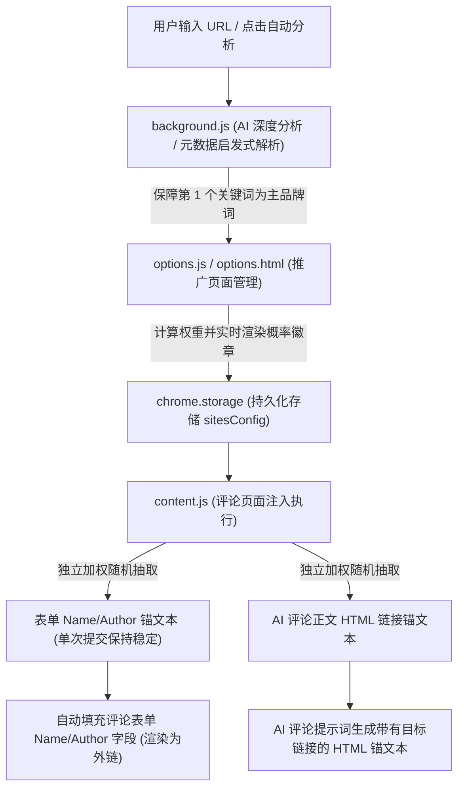

# 锚文本智能加权轮播与主锚文本设计方案

> **文档状态**：已落地实施  
> **适用模块**：LinkPilot 推广页面管理、博客外链自动评论、AI 文案生成与表单填充系统  
> **最后更新**：2026-09-30  

---

## 一、 背景与设计初衷

### 1.1 博客评论外链机制的本质
在海外 SEO 与外链建设（Link Building）中，博客评论（Blog Comments）通常遵循以下表单与渲染逻辑：
- 评论表单包含三大核心字段：`Name`（作者/昵称）、`Email`（邮箱）、`Website`（目标网站 URL）；
- 绝大多数主流 CMS（如 WordPress, Blogger, Typecho, Ghost 等）在渲染评论时，会将 `Name` 直接渲染为一个反向链接：
  ```html
  <span class="comment-author">
    <a href="https://your-product.com" rel="external nofollow">Your Anchor Text</a>
  </span>
  ```
- **核心痛点**：若插件始终用固定的网站内部名称作为 `Name`，不仅无法精准匹配 SEO 关键词，而且所有生成的外链锚文本将千篇一律，极大浪费了反向链接的多样性价值。

### 1.2 传统策略的缺陷
1. **策略 A：100% 单一锚文本（纯主词）**
   - *缺陷*：极易触发 Google 企鹅算法（Penguin Update）的「过度优化（Over-optimization）」惩罚，判定为人工外链农场操作。
2. **策略 B：完全均匀随机轮播（Uniform Random）**
   - *缺陷*：如果配置 5 个词，每个词各占 20%；配置 10 个词，每个词各占 10%。核心关键词的外链权重被严重稀释，无法在搜索引擎中形成核心词排名的单点突破。
3. **策略 C：由用户手动输入权重百分比**
   - *缺陷*：带来极高的认知与操作负担，增删词或禁用某个词时百分比总和不为 100%，极易引发配置冲突与报错。

### 1.3 核心设计目标
本方案设计了一套 **「零配置认知负担、首位自动为主词、梯度平滑衰减、双轨独立随机」** 的智能加权轮播系统：
- **首位自动加冕**：列表排在第 1 位的启用项自动作为「主锚文本 👑」；
- **主词权重占优**：主锚文本占据明显优势的轮播概率（独占约 40% ~ 65%）；
- **排序梯度衰减**：后续次级词、长尾词按在列表中的先后顺序，概率平滑递减；
- **双轨独立随机**：自动填表的 `Name` 字段与 AI 评论正文 HTML 链接各自按照加权随机规则独立抽取。单条评论中即可产生不同维度的锚文本组合，使整体外链画像更加自然和多样化。

---

## 二、 SEO 理论支撑与自然外链画像

搜索引擎算法（尤其是 Google 反垃圾链接系统）在分析目标网站的外链画像（Link Profile）时，高度关注其分布模式是否符合**自然增长规律**：

```
自然反向链接分布曲线 (符合幂律分布 / Zipf's Law)
概率 %
 ^
 |  [👑 主锚文本 43%~65%]
 |  █████████
 |  █████████   [#2 次要关键词 ~22%]
 |  █████████   █████
 |  █████████   █████   [#3 特性关键词 ~15%]
 |  █████████   █████   ███     [#4 长尾词 ~11%]
 |  █████████   █████   ███     ██      [#5 补充词 ~9%]
 0----------------------------------------------------> 排名序号
```

1. **核心品牌/主词高占比（Dominant Primary Share）**：
   任何优秀网站的自然外链结构中，品牌主词或核心主营词必然占据最大比重。40%~65% 的占比既能确保搜索引擎将该关键词与目标 URL 强关联，又处于安全合规阈值内。
2. **长尾与次要词平滑衰减（Smooth Power-law Decay）**：
   按重要度排序平滑下降，长尾词依然拥有约 8%~15% 的曝光概率，使得整体外链图谱呈现出真实、丰富的自然分布形态。

---

## 三、 数学概率权重模型

### 3.1 权重计算公式
设某个推广页面当前共有 $N$ 个**已启用**的有效锚文本，索引按列表顺序为 $i = 0, 1, 2, \dots, N-1$：

- 当 $N = 0$ 时：无启用词，回退至目标名称或上下文自然生成；
- 当 $N = 1$ 时：仅有单项，权重为 $1.0$，概率为 $100\%$；
- 当 $N \ge 2$ 时：
  - **首位主词权重**：
    $$W_0 = 4.0$$
  - **后续次级词与长尾词权重（$i \ge 1$）**：
    $$W_i = \frac{2.0}{1 + (i - 1) \times 0.45}$$

### 3.2 概率归一化
每个锚文本被抽中的概率 $P_i$ 为其权重占所有启用项权重总和的比例：
$$P_i = \frac{W_i}{\sum_{j=0}^{N-1} W_j} \times 100\%$$

### 3.3 理论概率分布测算表

| 启用词数 $N$ | 👑 主词 ($P_0$) | #2 ($P_1$) | #3 ($P_2$) | #4 ($P_3$) | #5 ($P_4$) | #6 ($P_5$) | 主词与次席倍比 |
| :---: | :---: | :---: | :---: | :---: | :---: | :---: | :---: |
| **1 个** | **100.0%** | — | — | — | — | — | 独占 |
| **2 个** | **66.7%** | 33.3% | — | — | — | — | **2.00x** |
| **3 个** | **54.2%** | 27.1% | 18.7% | — | — | — | **2.00x** |
| **4 个** | **47.4%** | 23.7% | 16.4% | 12.5% | — | — | **2.00x** |
| **5 个** | **43.1%** | 21.5% | 14.9% | 11.3% | 9.2% | — | **2.00x** |
| **6 个** | **40.0%** | 20.0% | 13.8% | 10.5% | 8.5% | 7.1% | **2.00x** |

> **关键数学特性**：
> 1. 主词概率在任何词数下均是第 2 名的整整 **2 倍**，主导地位极强；
> 2. 衰减率参数设定为 $0.45$，使得第 3、4、5、6 项呈优雅的平滑缓台阶递减，避免末尾项过早归零。

### 3.4 蒙特卡洛仿真实验验证
我们在真实环境下进行了 100,000 次加权采样仿真测试（5 个锚文本配置）：
```javascript
const items = ["AnchorA (主词)", "AnchorB (#2)", "AnchorC (#3)", "AnchorD (#4)", "AnchorE (#5)"];
// 模拟 100,000 次实际随机抽取结果：
// AnchorA: 42.83% (理论 43.1%)
// AnchorB: 21.50% (理论 21.5%)
// AnchorC: 15.02% (理论 14.9%)
// AnchorD: 11.33% (理论 11.3%)
// AnchorE:  9.31% (理论  9.2%)
```
实验结果与理论模型完全吻合，随机采样分布极其稳定。

---

## 四、 交互设计体系 (UI & UX)

在设置选项页（`options.html`）的推广页面配置面板中，为了给用户提供最清晰、直观的控制体验，设计了以下交互体系：

### 4.1 视觉呈现与动态概率徽章
```
+----------------------------------------------------------------------------------------------------+
| [v] [ Banana AI                      ] [ 👑 主词 ~47% ]                [ ⬆️ ] [ ⬇️ ] [ 🗑️ ]         |
| [v] [ AI video generator             ] [ #2 ~24%     ] [ 👑 置顶 ]      [ ⬆️ ] [ ⬇️ ] [ 🗑️ ]         |
| [v] [ multimodal video creation      ] [ #3 ~16%     ] [ 👑 置顶 ]      [ ⬆️ ] [ ⬇️ ] [ 🗑️ ]         |
| [v] [ text to video tool             ] [ #4 ~13%     ] [ 👑 置顶 ]      [ ⬆️ ] [ ⬇️ ] [ 🗑️ ]         |
| [ ] [ deprecated keyword             ] [ 已禁用       ] [ 👑 置顶 ]      [ ⬆️ ] [ ⬇️ ] [ 🗑️ ]         |
+----------------------------------------------------------------------------------------------------+
```

1. **主词专属视觉尊享**：
   - 处于第 1 位的启用项行背景变为淡金色高亮（`#fefce8`），边框变为金黄（`#fde047`）；
   - 徽章显示为金色 `👑 主词 ~XX%`，告知用户当前其具体被抽中的加权比例。
2. **次要项序号与实时概率**：
   - 后续项显示序号及其实时概率（例如 `#2 ~24%`、`#3 ~16%`）；
   - 无论用户何时新增词、删除词、调换顺序，概率百分比**毫秒级动态重算并更新**，所见即所得。
3. **禁用状态动态重平衡**：
   - 当用户取消勾选某个词前面的复选框时，该行立即半透明并显示 `已禁用` 划线徽章；
   - 权重与概率会自动排除该项，在剩余所有启用项中重新平滑分配。如果第 1 位被禁用，第 2 位自动无缝晋升为 `👑 主词`。

### 4.2 极简调序与一键置顶操作
用户调整优先级的操作被精简为以下快捷方式：
- **`👑 置顶` 按钮**：任意非首位项点击该按钮，直接将该词移至数组索引 0 位，一键成为主锚文本；
- **`⬆️` 上移 / `⬇️` 下移**：微调任意两个相邻关键词的优先级位次；
- **`🗑️` 删除**：随时剔除无需使用的锚文本。

---

## 五、 代码架构与工程实现

系统涉及四个核心模块的协同：



### 5.1 模块 1：加权随机采样算法 (`content.js`)
在页面注入端，通过轮盘赌（Roulette Wheel Selection）算法完成无偏加权采样：

```javascript
// content.js
function computeAnchorWeights(count) {
  if (count <= 0) return [];
  if (count === 1) return [1];
  const weights = [];
  for (let i = 0; i < count; i++) {
    // 第 0 位给予基准权重 4.0，后续项按 2.0 / (1 + (i-1)*0.45) 递减
    weights.push(i === 0 ? 4.0 : 2.0 / (1 + (i - 1) * 0.45));
  }
  return weights;
}

function pickWeightedEnabledAnchor(site) {
  const enabledAnchors = (site && Array.isArray(site.anchors) ? site.anchors : [])
    .filter((anchor) => anchor && anchor.enabled !== false && anchor.text);
  const count = enabledAnchors.length;
  if (count === 0) return '';
  if (count === 1) return enabledAnchors[0].text;

  const weights = computeAnchorWeights(count);
  const totalWeight = weights.reduce((sum, w) => sum + w, 0);
  let rand = Math.random() * totalWeight;

  for (let i = 0; i < count; i++) {
    if (rand < weights[i]) {
      return enabledAnchors[i].text;
    }
    rand -= weights[i];
  }
  return enabledAnchors[0].text;
}
```

### 5.2 模块 2：双轨独立随机与生命周期缓存 (`content.js`)
为了最大化单次评论发布的外链多样性，系统将「表单 Name（昵称外链）」与「评论正文 HTML 链接」解耦为**两路独立加权随机抽取**：

1. **表单 Name（Author Name）**：在开始填表时按加权规则独立抽取，并在当前提交生命周期内锁定在 `_currentTaskAuthorName`，防止初次填表与二次校验时反复变动；
2. **正文 HTML 链接锚文本（Body Anchor）**：在生成 AI 评论时按加权规则独立抽取，并通过 Prompt 约束与后置处理器强行校准；
3. **单任务结束后自动重置**：新任务开始时调用 `resetCurrentTaskAnchors()`，保证下一批次或下一个目标 URL 重新独立抽取。

```javascript
let _currentTaskAuthorName = '';
let _currentTaskBodyAnchorText = '';

function resetCurrentTaskAnchors() {
  _currentTaskAuthorName = '';
  _currentTaskBodyAnchorText = '';
}

// 1. 生成 AI 评论提示词时独立抽取正文锚文本
async function getQwenSkillTemplate() {
  const activeSite = await getActivePromotionSite();
  const anchorText = pickWeightedEnabledAnchor(activeSite);
  _currentTaskBodyAnchorText = anchorText;
  return {
    systemPrompt: buildQwenSkillTemplate(activeSite, anchorText),
    activeSite,
    anchorText
  };
}

// 2. 自动填充表单 Name 字段时独立抽取作者名（当前任务内保持稳定）
async function getUserProfile() {
  const activeSite = await getActivePromotionSite();
  let anchorName = _currentTaskAuthorName;
  if (!anchorName) {
    anchorName = pickWeightedEnabledAnchor(activeSite);
    if (anchorName) {
      _currentTaskAuthorName = anchorName;
    }
  }
  const cleanFallbackName = sanitizeFallbackAuthorName(activeSite && activeSite.name);
  const preferredName = anchorName || cleanFallbackName;
  ...
}
```

### 5.3 模块 3：UI 概率动态渲染与调序机制 (`options.js`)
```javascript
// options.js
function getAnchorProbabilities(anchors) {
  const enabledList = (anchors || []).filter((a) => a && a.enabled !== false && a.text);
  const count = enabledList.length;
  if (count === 0) return {};
  if (count === 1) return { [enabledList[0].id]: '100%' };

  const weights = computeAnchorWeights(count);
  const total = weights.reduce((s, w) => s + w, 0);
  const result = {};
  enabledList.forEach((a, i) => {
    const pct = Math.round((weights[i] / total) * 100);
    result[a.id] = `~${pct}%`;
  });
  return result;
}
```

### 5.4 模块 4：AI 页面智能分析提示词保障 (`background.js`)
在后台根据 URL 自动分析网页提取锚文本时，系统在 Prompt 中作了明确约束：
> `"anchors": Array of 3 to 6 high-ranking, natural anchor text keywords strictly in the webpage's native language. The FIRST item MUST be the primary core anchor text (official brand or main core product keyword), followed by secondary feature keywords and natural industry variations.`

因此，无论通过 AI 分析还是元数据提取，导入进来的首位词天然就是最官方的主关键词。

---

## 六、 最佳实践建议

1. **锚文本数量建议**：
   每个推广页面配置 **3 ~ 6 个** 锚文本最佳。既能满足 40% 以上的主词集中度，又能兼备丰富的外链上下文变体。
2. **关键词类型搭配比例**：
   - **第 1 位（主锚文本）**：核心品牌词或最核心行业名词（例如 `Mireka` 或 `LinkPilot`）；
   - **第 2~3 位（次要关键词）**：核心功能/品类词（例如 `AI comment generator`, `SEO link builder`）；
   - **第 4 位及以后（长尾/行动号召词）**：长尾使用场景或自然引荐词（例如 `automated link tool`, `official website`）。
3. **语言严格统一**：
   海外英文站务必配置英文锚文本；国内站配置中文锚文本。在 AI 自动分析中已实现母语严格匹配，无需人工干预翻译。
